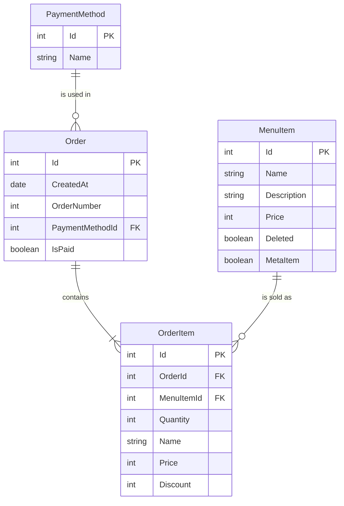

```mermaid
erDiagram
    MenuItem {
        int Id PK
        string Name
        string Description
        int Price
        boolean Deleted
        boolean MetaItem
    }

    Order {
        int Id PK
        date CreatedAt
        int OrderNumber
        int PaymentMethodId FK
        boolean IsPaid
    }

    PaymentMethod {
        int Id PK
        string Name
    }

    OrderItem {
        int Id PK
        int OrderId FK
        int MenuItemId FK
        int Quantity
        string Name
        int Price
        int Discount
    }

    %% Relationships
    PaymentMethod ||--o{ Order : "is used in"
    Order ||--|{ OrderItem : "contains"
    MenuItem ||--o{ OrderItem : "is sold as"
```
